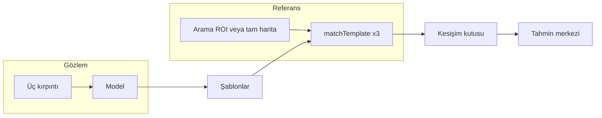

# GPS’siz yerelleştirme simülasyonu

Bu depo, İHA’nın **gözlem haritasından** üç komşu bölgeden alınan görüntüleri (üçlü şablon) bir **derin öğrenme modelinden** geçirip, çıktıları **referans haritada** OpenCV şablon eşleştirmesi ile arayarak konum tahmini sürecini simüle eder. Tahmin, üç eşleşme kutusunun kesişiminden veya geometrik tutarlılık modlarından türetilir; arama bölgesi (ROI) önceki tahmine göre uyarlanır veya tüm haritaya genişler.

Ana uygulama `simulasyon_yonlendirme_uclu_dashboard.py`: sol tarafta gözlem ve model çıktıları, sağda referans harita önizlemesi ve HUD ile tek bir OpenCV penceresinde çalışır.

---

## Depo yapısı

| Dosya | Rol |
|--------|-----|
| `simulasyon_yonlendirme_uclu_dashboard.py` | Ana simülasyon, dashboard, şablon eşleştirme ve isteğe bağlı tanılama toplu çalıştırması |
| `gps_denied_autonomy.py` | Görev senaryoları, kalite metrikleri ve otonom hareket seçimi için **bağımsız** yardımcı modül (şu an dashboard tarafından import edilmez; deneyler veya başka betikler için) |
| `simulasyon_yonlendirme_model_okuma.py` | Model okuma / ilgili deney akışı |
| `simulasyon_yonlendirme.py`, `simulasyon_yonlendirme_uclu.py` | Daha eski veya sadeleştirilmiş yönlendirme denemeleri |
| `simulasyon_otonom.py`, `simulasyon_konuma_otonom_gitme*.py`, `simulasyon_hizli.py` | Otonom veya hızlı varyant denemeleri |
| `template_matching_dongu.py`, `image_rotate.py`, `image_rotate_funcs.py` | Şablon eşleştirme ve görüntü dönüş yardımcıları |
| `GPS_DENIED_REVIEW.md` | GPS’siz otonomi ve kalite mantığına dair notlar |

---

## Gereksinimler

- **Python** 3.8+ (3.x; TensorFlow sürümünüze uygun bir Python seçin)
- **OpenCV** (`cv2`) — görüntü I/O, `matchTemplate`, arayüz
- **NumPy**
- **Rasterio** — `.tif` / GeoTIFF okuma; gözlemi referans ızgarasına hizalama
- **pyproj** — koordinat dönüşümleri (irtifa / DEM ile arazi örneklemesi)
- **TensorFlow 2 + Keras** — `.h5` model yükleme; eski modeller için `Conv2DTranspose` uyumluluk sınıfı kullanılır

Örnek kurulum:

```bash
pip install opencv-python numpy rasterio pyproj tensorflow
```

GPU isteğe bağlıdır; CPU ile de çalışır, model çıkarımı daha yavaş olur. Çok büyük rasterler için `OPENCV_IO_MAX_IMAGE_PIXELS` betik içinde yükseltilmiştir.

---

## Veri dosyaları ve yollar

Tüm yollar `SimulationConfig` içinde `pathlib.Path` olarak tanımlıdır; kendi harita ve model dosyalarınıza göre düzenlemeniz gerekir.

| Alan | Açıklama |
|------|----------|
| `reference_map_path` | Referans harita: GeoTIFF (`.tif`) veya düz gri görüntü |
| `observation_map_path` | Gözlem kaynağı (genelde uydudan / ortofoto raster) |
| `observation_georef_path` | Gözlemin jeodezik referansı (çoğu kurulumda gözlem haritası ile aynı dosya) |
| `observation_grid_georef_path` | İsteğe bağlı; `align_observation_to_reference_grid=True` iken hizalama için kullanılır |
| `dem_path` | **Yalnızca `scenario_mode` irtifa senaryosunda** zemin yüksekliği ve AGL hesabı |
| `model_path` | Keras `.h5` modeli (giriş boyutu `model_input_size` ile uyumlu olmalı) |

**Senaryo modu** (`scenario_mode`):

- `"normal"` veya `"standart"` — Sabit ölçek / irtifa varsayımı; DEM yüklenmez.
- `"irtifa"` / `"altitude"` / `"elevation"` — Sanal kamera GSD’si, yama ölçekleri ve zemin kotu için DEM + gözlem rasteri kullanılır.

Gözlem piksel boyutu referanstan farklıysa `load_assets` gözlemi referans boyutuna **yeniden örnekler**.

---

## Çalıştırma

Proje kökünden (veya veri dosyalarının göreli yolların doğru çözüldüğü dizinden):

```bash
python simulasyon_yonlendirme_uclu_dashboard.py
```

Yapılandırma **komut satırı argümanı kullanmaz**; tüm parametreler `SimulationConfig` dataclass varsayılanlarıdır. Davranışı değiştirmek için ilgili sınıfı düzenleyin veya kodda `SimulationConfig(...)` örneği oluşturup `main()` içine bağlayın.

---

## İşleyiş özeti (pipeline)

1. **Varlık yükleme** — Referans ve gözlem haritaları gri ton matrisi olarak; model `load_model_compat` ile.
2. **Üçlü çıkarım** — Gözlem üzerinde başlığa göre döndürülmüş büyük bir yakalama alanından üç komşu pencere; her biri modele girer, çıkan şablonlar referansta aranır.
3. **Eşleştirme** — `cv2.matchTemplate` (varsayılan `TM_CCOEFF_NORMED`); isteğe bağlı **piramit** (`coarse_scale` + dar ROI) ve **3 iş parçacığı** ile üç şablon paralel.
4. **Kesişim** — Üç eşleşme kutusunun kesişimi veya çiftler üzerinden `intersection_mode` (ör. `abc`, `ab`, …).
5. **Arama penceresi** — İlk adımda gerçek kesişim merkezi çapa yardımcı olur; sonraki adımlarda **katı üçlü hizalama** (`is_strict_triplet_alignment`) sağlanırsa tahmin güncellenir ve taban pencere boyutuna dönülür; aksi halde pencere `search_window_growth_step` veya `search_window_failure_growth` ile büyür (üst sınır `max_search_window_size`).
6. **Global arama** — Önceki tahmin yoksa veya `global_refresh_interval > 0` ile periyodik olarak tüm referans harita kullanılır.



---

## `SimulationConfig` — seçilmiş alanlar

Aşağıdaki gruplar, sık değişen veya anlamı net olmayan alanları listeler; tam liste için kaynak dosyasına bakın.

### Gözlem ve model boyutları

- `sample_window_size`, `model_input_size`, `crop_margin`, `template_size` — Birbirleriyle tutarlı olmalı; `validate_config` model çıktı boyutunun `template_size` ile eşleşmesini kontrol eder.
- `template_offset` — Üç şablonun beklenen göreli aralığı (piksel); katı hizalama testinde kullanılır.

### Hareket ve başlangıç

- `initial_row` / `initial_col`, `random_start`, `random_start_middle_band_ratio` — Başlangıç gözlem imleci; rastgele modda merkeze bias’lı örnekleme.
- `step_size`, `initial_heading_degrees`, `rotation_step_degrees`
- `initial_altitude_agl_m`, `altitude_step_m`, `min_altitude_agl_m`, `max_altitude_agl_m`, `minimum_patch_agl_m`

### Kamera ve ölçek (irtifa senaryosu)

- `reference_map_gsd_cm_per_px`, `camera_sensor_width_mm`, `camera_focal_length_mm`, `virtual_camera_width_px`

### Eşleştirme ve arama

- `match_method` — Örn. `cv2.TM_CCOEFF_NORMED`; SQDIFF ailesi için min/max seçimi kodda ayrı işlenir.
- `use_parallel_matching`, `use_pyramid_matching`, `coarse_scale`, `roi_pad_factor`
- `base_search_window_size`, `max_search_window_size`, `search_window_growth_step`, `search_window_failure_growth`
- `triplet_alignment_tolerance_px` — Üç kutunun “kilit” sayılması için geometrik tolerans
- `global_refresh_interval` — `0` dışında ise belirli adımlarda tam harita araması

### Arayüz

- `display_size`, `left_panel_width_ratio`, panel renkleri, `path_history_limit`
- `ui_buttons_enabled` — Fare ile üst kısayol düğmeleri
- `show_*` bayrakları — Bilgi paneli, trajektori, ROI çerçevesi, TM kutuları, yön oku, gözlem kutuları

### Toplu tanılama (diagnostic)

- `diagnostic_benchmark_enabled` — Açılırsa başlangıçta `run_template_diagnostics` çalışır
- `diagnostic_benchmark_only` — `True` ise PNG/JSON yazıldıktan sonra dashboard açılmadan çıkılır
- `diagnostic_output_dir` — Çıktı kökü (varsayılan `diagnostics/`)
- `diagnostic_tile_size` — Görüntü bileşimi için karo boyutu
- `diagnostic_benchmark_points` — `(satır, sütun)` tohum listesi; imleç sınırları içine kısıtlanır

Tanı çıktısı: `diagnostics/template_diag_YYYYMMDD_HHMMSS/` altında her vaka için `case_XX_..._triptych.png`, `case_XX_..._meta.json` ve `summary.json`.

---

## Klavye ve fare

### Hareket ve çıkış

| Girdi | İşlev |
|--------|--------|
| **W A S D** | Gözlem imlecini hareket |
| **Q / E** | Sola / sağa başlık (derece adımı `rotation_step_degrees`) |
| **+ / = / −** | İrtifa senaryosunda AGL artır/azalt (`altitude_step_m`) |
| **ESC** veya **X** | Çıkış |

OpenCV bazen ok tuşu kodları da üretir; kodda bu sanal kodlar da tanımlıdır.

### HUD / katman kısayolları

| Tuş | Özellik |
|-----|---------|
| **H** | Sol panel daraltma |
| **B** | Bilgi paneli |
| **T** | Trajektori |
| **O** | ROI çerçevesi |
| **R** | TM (eşleşme) kutuları |
| **Y** | Yön oku |
| **G** | Gözlem kutuları |

`ui_buttons_enabled=True` iken aynı işlevler fare ile panel düğmelerinden de açılıp kapatılabilir.

Konsolda her adımda skorlar, `intersection_mode`, arama modu (`global` / `adaptive-roi`), eşleştirme backend etiketi (`parallel-pyramid` vb.) ve tahmin hatası (piksel) yazdırılır.

---

## Model uyumluluğu

Eski Keras modellerinde `Conv2DTranspose` içinde `groups` parametresi varsa yükleme hata verebilir. `load_model_compat` özel `_CompatConv2DTranspose` ile bu alanı atlayarak yükleme dener.

---

## `.gitignore` ve büyük veriler

Depo `.gitignore` ile çoğu dosyayı dışarıda bırakır; yalnızca seçili uzantılara izin verilir. Harita, DEM ve `.h5` modelleri genelde repoda yoktur — bunları yerel dizinlere koyup `SimulationConfig` yollarını güncelleyin.

---

## İlgili dokümantasyon

`GPS_DENIED_REVIEW.md` — GPS’siz otonomi ve güven skorları üzerine metinsel inceleme.

`gps_denied_autonomy.py` — Görev waypoint’leri, güvenilirlik ve otonom aksiyon seçimi gibi yapılar içerir; yeni bir otonom katmanı veya ayrı bir deney betiği yazarken başlangıç noktası olarak kullanılabilir.
